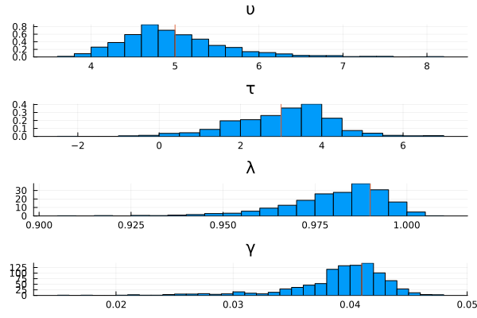
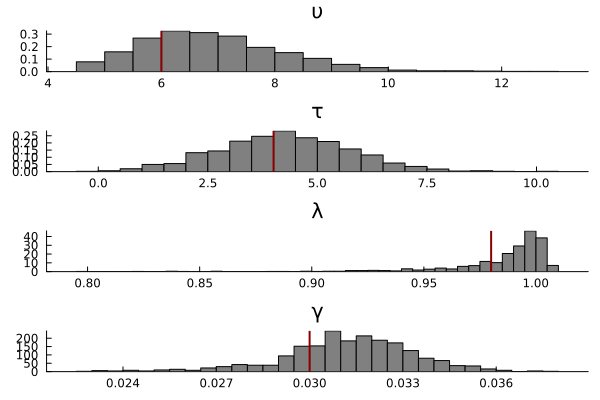

# Introduction 

This page demonstrates how to perform amortized Bayesian inference using neural networks. Click below to reveal a full copy-and-pastable version of the code.

```@raw html
<details>
<summary><b>Show Full Code</b></summary>
```
```julia
using ACTRPVT
using AlgebraOfGraphics
using CairoMakie
using Distributions
using Flux
using NeuralEstimators
using Plots

n = 1           # dimension of each data replicate 
m = 50          # number of independent replicates 
d = 4           # dimension of the parameter vector θ
w = 128         # width of each hidden layer 

function sample(K)
    υτ = rand(MvNormal([5, 4], [4 2; 2 4]), K)
    λ = rand(Beta(98, 2), K)
    γ = rand(truncated(Normal(.04, .01),0, Inf), K)
    θ = vcat(υτ, λ' , γ')
    return θ
end
to_matrix(x) = reshape(x, 1, length(x))
simulate(θ, m) = [to_matrix(rand(PVTModel(ϑ...), m)) for ϑ ∈ eachcol(θ)] 

# Approximate distribution
approx_dist = NormalisingFlow(d, 2d)

# Neural network mapping data to summary statistics (of the same dimension used in the approximate distribution)
ψ = Chain(x -> sign.(x) .* log.(1 .+ abs.(x)), Dense(n, w, relu), Dense(w, w, relu)) # NB now using log-transform for numerical stability
ϕ = Chain(Dense(w, w, relu), Dense(w, 2d))           
network = DeepSet(ψ, ϕ)

# Initialise a neural posterior estimator
estimator = PosteriorEstimator(approx_dist, network) 

# Train the estimator
trained_estimator = train(
    estimator, 
    sample, 
    simulate; 
    m, 
    epochs = 20,
    K = 10_000
)

# Assess the estimator
θ_test = sample(1000)
Z_test = simulate(θ_test, m)
assessment = assess(trained_estimator, θ_test, Z_test)
bias(assessment)  
rmse(assessment) 
AlgebraOfGraphics.plot(assessment)

# Apply the estimator to observed data
θ = [5,3,.99,.041]       # true parameters
Z = simulate(θ, m)       # "observed" data
post_samples = sampleposterior(trained_estimator, Z)
Plots.histogram(post_samples', layout = (4,1), norm = true, leg = false, title = ["υ" "τ" "λ" "γ"])
vline!([θ'], color = :red)

# Apply the estimator to observed data
θ = [2,3,.96,.031]       # true parameters
Z = simulate(θ, m)       # "observed" data
post_samples = sampleposterior(trained_estimator, Z)
Plots.histogram(post_samples', layout = (4,1), norm = true, leg = false, title = ["υ" "τ" "λ" "γ"])
vline!([θ'], color = :red)
```
```@raw html
</details>
```
# Load the Dependencies

```julia
using ACTRPVT
using AlgebraOfGraphics
using CairoMakie
using Distributions
using Flux
using NeuralEstimators
using Plots
```

```julia
n = 1           # dimension of each data replicate 
m = 50          # number of independent replicates 
d = 4           # dimension of the parameter vector θ
w = 128         # width of each hidden layer 
```

```julia
function sample(K)
    υτ = rand(MvNormal([5, 4], [4 2; 2 4]), K)
    λ = rand(Beta(98, 2), K)
    γ = rand(truncated(Normal(.04, .01),0, Inf), K)
    θ = vcat(υτ, λ' , γ')
    return θ
end
```
```julia
to_matrix(x) = reshape(x, 1, length(x))
simulate(θ, m) = [to_matrix(rand(PVTModel(ϑ...), m)) for ϑ ∈ eachcol(θ)] 
```
# Configure the Neural Network
```julia
approx_dist = NormalisingFlow(d, 2d)

ψ = Chain(x -> sign.(x) .* log.(1 .+ abs.(x)), Dense(n, w, relu), Dense(w, w, relu))
ϕ = Chain(Dense(w, w, relu), Dense(w, 2d))           
network = DeepSet(ψ, ϕ)
```

### create the estimator
```julia
estimator = PosteriorEstimator(approx_dist, network) 
```
# Train the estimator

```julia
trained_estimator = train(
    estimator, 
    sample, 
    simulate; 
    m, 
    epochs = 20,
    K = 10_000
)
```
# Assess the estimator
```julia
θ_test = sample(1000)
Z_test = simulate(θ_test, m)
assessment = assess(trained_estimator, θ_test, Z_test)
bias(assessment)  
rmse(assessment) 
AlgebraOfGraphics.plot(assessment)
```
# Estimate the Posterior Distributions

The examples below estimate the posterior distributions using data generated from two different sets of parameters. The vertical red lines in each sub-plot indicate the ground truth parameter values. 

```julia
θ = [5,3,.99,.041]       # true parameters
Z = simulate(θ, m)       # "observed" data
post_samples = sampleposterior(trained_estimator, Z)
Plots.histogram(post_samples', layout = (4,1), norm = true, leg = false, title = ["υ" "τ" "λ" "γ"])
vline!([θ'], color = :red)
```

```julia
θ = [2,3,.96,.031]       # true parameters
Z = simulate(θ, m)       # "observed" data
post_samples = sampleposterior(trained_estimator, Z)
Plots.histogram(post_samples', layout = (4,1), norm = true, leg = false, title = ["υ" "τ" "λ" "γ"])
vline!([θ'], color = :red)
```

