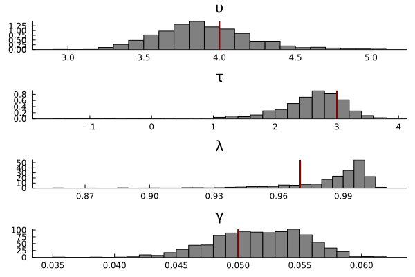

!!! note "Warning"
    Docs are a work in progress.

# Introduction 

This page demonstrates how to perform amortized Bayesian inference using neural networks. Click below to reveal a full copy-and-pastable version of the code.

```@raw html
<details>
<summary><b>Show Full Code</b></summary>
```
```julia
using ACTRPVT
using AlgebraOfGraphics
using BSON: @save
using CairoMakie
using Distributions
using Flux
using NeuralEstimators
using Plots

n = 1           # dimension of each data replicate 
m = 50          # number of independent replicates 
d = 4           # dimension of the parameter vector θ
w = 128         # width of each hidden layer 

function sample(K)
    υτ = rand(MvNormal([5, 4], [4 2; 2 4]), K)
    λ = rand(Beta(25, .5), K)
    γ = rand(truncated(Normal(.04, .015),.01, Inf), K)
    θ = vcat(υτ, λ' , γ')
    return θ
end
to_matrix(x) = reshape(x, 1, length(x))
simulate(θ, m) = [to_matrix(rand(PVTModel(ϑ...), m)) for ϑ ∈ eachcol(θ)] 

# Approximate distribution
approx_dist = NormalisingFlow(d, 2d)

# Neural network mapping data to summary statistics (of the same dimension used in the approximate distribution)
ψ = Chain(x -> sign.(x) .* log.(1 .+ abs.(x)), Dense(n, w, relu), Dense(w, w, relu))  
ϕ = Chain(Dense(w, w, relu), Dense(w, 2d))           
network = DeepSet(ψ, ϕ)

# Initialise a neural posterior estimator
estimator = PosteriorEstimator(approx_dist, network) 

# Train the estimator
estimator = train(
    estimator, 
    sample, 
    simulate; 
    m, 
    K = 15_000
)

# Assess the estimator
θ_test = sample(1000)
Z_test = simulate(θ_test, m)
assessment = assess(estimator, θ_test, Z_test; parameter_names = ["υ", "τ", "λ", "γ"])
bias(assessment)  
rmse(assessment) 
recovery_plot = AlgebraOfGraphics.plot(assessment)

# Apply the estimator to observed data
title = ["υ" "τ" "λ" "γ"]
θ = [4, 3, 0.97, 0.05]       # true parameters
Z = simulate(θ, m)      # "observed" data
post_samples = sampleposterior(estimator, Z)
Plots.histogram(
    post_samples';
    layout = (4, 1),
    color = :grey,
    grid = false,
    norm = true,
    leg = false,
    title
)
vline!([θ'], color = :darkred, linewidth = 2)

# Apply the estimator to observed data
θ = [6, 4, 0.98, 0.03]       # true parameters
Z = simulate(θ, m)      # "observed" data
post_samples = sampleposterior(estimator, Z)
Plots.histogram(
    post_samples';
    layout = (4, 1),
    color = :grey,
    grid = false,
    norm = true,
    leg = false,
    title
)
vline!([θ'], color = :darkred, linewidth = 2)
```
```@raw html
</details>
```
# Load the Dependencies

```julia
using ACTRPVT
using AlgebraOfGraphics
using BSON: @save
using CairoMakie
using Distributions
using Flux
using NeuralEstimators
using Plots
```

```julia
n = 1           # dimension of each data replicate 
m = 50          # number of independent replicates 
d = 4           # dimension of the parameter vector θ
w = 128         # width of each hidden layer 
```

```julia
function sample(K)
    υτ = rand(MvNormal([5, 4], [4 2; 2 4]), K)
    λ = rand(Beta(25, .5), K)
    γ = rand(truncated(Normal(.04, .015),.01, Inf), K)
    θ = vcat(υτ, λ' , γ')
    return θ
end
```
```julia
to_matrix(x) = reshape(x, 1, length(x))
simulate(θ, m) = [to_matrix(rand(PVTModel(ϑ...), m)) for ϑ ∈ eachcol(θ)] 
```
# Configure the Neural Network
```julia
approx_dist = NormalisingFlow(d, 2d)

ψ = Chain(x -> sign.(x) .* log.(1 .+ abs.(x)), Dense(n, w, relu), Dense(w, w, relu))
ϕ = Chain(Dense(w, w, relu), Dense(w, 2d))           
network = DeepSet(ψ, ϕ)
```

### create the estimator
```julia
estimator = PosteriorEstimator(approx_dist, network) 
```
# Train the estimator

```julia
estimator = train(
    estimator, 
    sample, 
    simulate; 
    m, 
    K = 15_000
)
```
# Assess the estimator
```julia
θ_test = sample(1000)
Z_test = simulate(θ_test, m)
assessment = assess(estimator, θ_test, Z_test; parameter_names = ["υ", "τ", "λ", "γ"])
bias(assessment)  
rmse(assessment) 
recovery_plot = AlgebraOfGraphics.plot(assessment)
```


# Estimate the Posterior Distributions

The examples below estimate the posterior distributions using data generated from two different sets of parameters. The vertical red lines in each sub-plot indicate the ground truth parameter values. 

```julia
title = ["υ" "τ" "λ" "γ"]
θ = [4, 3, 0.97, 0.05]       # true parameters
Z = simulate(θ, m)      # "observed" data
post_samples = sampleposterior(estimator, Z)
Plots.histogram(
    post_samples';
    layout = (4, 1),
    color = :grey,
    grid = false,
    norm = true,
    leg = false,
    title
)
vline!([θ'], color = :darkred, linewidth = 2)
```

```julia
θ = [6, 4, 0.98, 0.03]       # true parameters
Z = simulate(θ, m)      # "observed" data
post_samples = sampleposterior(estimator, Z)
Plots.histogram(
    post_samples';
    layout = (4, 1),
    color = :grey,
    grid = false,
    norm = true,
    leg = false,
    title
)
vline!([θ'], color = :darkred, linewidth = 2)
```


# Save the Trained Neural Network

One main benefit of amortized inference is that the trained neural network can be saved and reused in different applications. The code block below shows how to save the weights of the trained neural network.

```julia
model_state = Flux.state(estimator)
@save "actr_pvt_model.bson" model_state
```
# Reload the Trained Neural Network

The weights can be reloaded into a new Julia session via:
```julia
@load "actr_pvt_model.bson" model_state
Flux.loadmodel!(estimator, model_state)
```
Note that you will need to load dependencies and initialize a new neural network before passing the weights. Click the code below to see a full working example.
```@raw html
<details>
<summary><b>Show Full Code</b></summary>
```
```julia
using ACTRPVT
using AlgebraOfGraphics
using BSON: @load
using CairoMakie
using Distributions
using Flux
using NeuralEstimators
using Plots

n = 1           # dimension of each data replicate 
m = 50          # number of independent replicates 
d = 4           # dimension of the parameter vector θ
w = 128         # width of each hidden layer 

function sample(K)
    υτ = rand(MvNormal([5, 4], [4 2; 2 4]), K)
    λ = rand(Beta(25, 0.5), K)
    γ = rand(truncated(Normal(0.04, 0.015), 0.01, Inf), K)
    θ = vcat(υτ, λ', γ')
    return θ
end
to_matrix(x) = reshape(x, 1, length(x))
simulate(θ, m) = [to_matrix(rand(PVTModel(ϑ...), m)) for ϑ ∈ eachcol(θ)]

# Approximate distribution
approx_dist = NormalisingFlow(d, 2d)

# Neural network mapping data to summary statistics (of the same dimension used in the approximate distribution)
ψ = Chain(x -> sign.(x) .* log.(1 .+ abs.(x)), Dense(n, w, relu), Dense(w, w, relu)) # NB now using log-transform for numerical stability
ϕ = Chain(Dense(w, w, relu), Dense(w, 2d))
network = DeepSet(ψ, ϕ)

# Initialise a neural posterior estimator
estimator = PosteriorEstimator(approx_dist, network)

@load "actr_pvt_model.bson" model_state
Flux.loadmodel!(estimator, model_state)
```
```@raw html
</details>
```